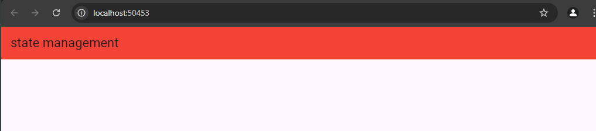
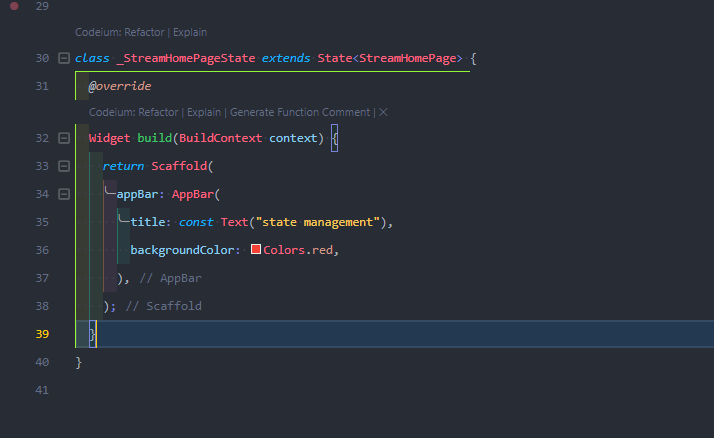
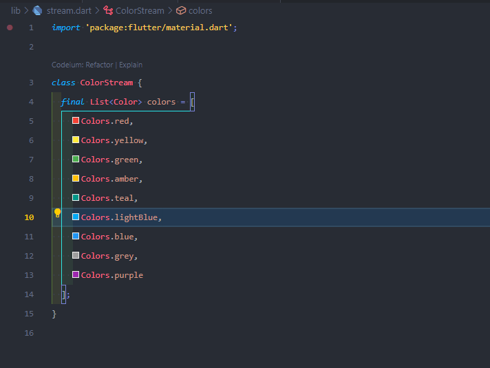
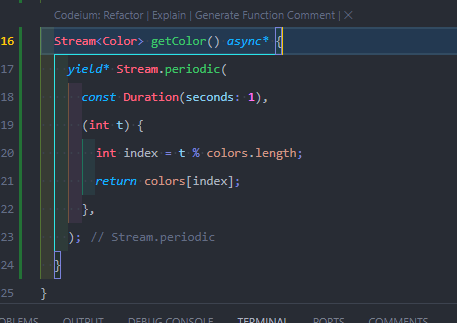

jawaban dari soal nomor 1

gambar di atas saya tambahkan scafold untuk menghias di karenakan pada modul nya tidak ada apa apa nya dikarenakan hanya membuat judul dari project nya.

jawaban dari soal 2

membuat class untuk meanmpung semua color

jawaban dari soal 3

kegunaan yield* yaitu untu menyalurkan nilai-nilai(event) dari stream lain ke stream yang di hasil kan generator

stream periodic digunakan untuk mebuat stream yang menghasilkan event baru setiap 1 detik (sesuai durasi) 
fungsi calback (int t) nanti akan di panggil setiap kali menghasilkan event, t akan bertambah setiap kali event di lakukan (dimulai dari 0)
t % colors.length memastikan indeks warna diambil secara siklikal dari list colors. seperti perulangan warna jika terdapat 3 warna maka akan berulang secara ururt pada 3 warna tersebut.
yield* Meneruskan semua nilai dari Stream.periodic ke dalam stream utama yang dihasilkan oleh getColor().